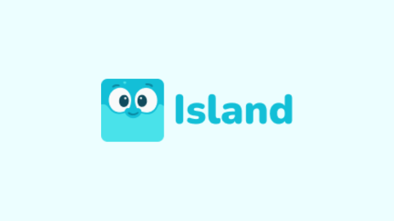

<div align="center">


</div>

# Island – Frontend

Software Island, apresenta pontos turísticos famosos, bares e restaurantes locais, cultura manezinha e estimula turistas a frequentar com uma usabilidade gameficada, disponibilizando pontos a cada ponto turístico ou bar/restaurante local frequentado.


## 👥 Equipe

<table>
  <tr>
    <td align="center">
      <br>
      <sub>
        <a href="https://github.com/nicholas-sc-08"><b>Nicholas Serencovich Carvalho</b></a>
      </sub><br>
      💻 Arquitetura e Desenvolvimento do Back-End
    </td>
    <td align="center">
      <br>
      <sub>
        <a href="https://github.com/eduardos4antos"><b>Eduardo Santos</b></a>
      </sub><br>
      🗄️ Apoio na Modelagem do Banco de Dados
    </td>
  </tr>
  <tr>
    <td align="center">
      <br>
      <sub>
        <a href="https://github.com/samuel-bordignon"><b>Samuel Bordignon</b></a>
      </sub><br>
      🎨 Desenvolvimento Front-End & UI/UX
    </td>
    <td align="center">
      <br>
      <sub>
        <a href="https://github.com/rinmarys"><b>Rinmarys Monagas</b></a>
      </sub><br>
      🎨 Desenvolvimento Front-End & UI/UX
    </td>
  </tr>
  <tr>
    <td align="center">
      <br>
      <sub>
        <a href="https://github.com/jailton-costa"><b>Jailton Costa</b></a>
      </sub><br>
      💻 Desenvolvimento Front-End
    </td>
    <td align="center">
      <br>
      <sub>
        <a href="https://github.com/DarlanHildebrando"><b>Darlan Hildebrando</b></a>
      </sub><br>
      ⚙️ Gestão e DevOps
    </td>
  </tr>
</table>

## ⚙️ Arquitetura

A aplicação foi desenvolvida utilizando o App Router do Next.js,
com separação de responsabilidades em camadas:

- Camada de Apresentação (app e components)
- Camada de Serviços (services)
- Camada de Utilitários (lib)
- Tipagem centralizada (types)
- Gerenciamento de estado via Context API

## 📌 Problema

Florianópolis recebe aproximadamente 2,4 milhões de turistas anualmente.  
Grande parte deles possui pouco conhecimento sobre a cidade e seus pontos turísticos, resultando em:

- Experiências genéricas
- Superlotação em praias populares
- Baixa exploração de cultura e comércio local
- Pouca distribuição inteligente do fluxo turístico


## 💡 Solução

O **Island** é uma plataforma gamificada que conecta turistas à verdadeira experiência da Ilha da Magia.

A aplicação:

- Apresenta pontos turísticos estratégicos
- Indica bares e restaurantes locais
- Promove a cultura manezinha
- Incentiva exploração inteligente da cidade
- Distribui fluxo turístico de forma equilibrada

Usuários acumulam pontos ao visitar locais recomendados, transformando a experiência em uma jornada interativa.

## 🎭 O Personagem: Tainho

Para tornar a experiência envolvente, criamos o personagem **Tainho**:

Um aventureiro entusiasmado que planeja jornadas semanais para turistas, guiando-os pelas melhores praias, trilhas e estabelecimentos locais.

Tainho:

- Sugere roteiros estratégicos
- Evita superlotação
- Incentiva descobertas autênticas
- Reage emocionalmente às escolhas do usuário (elemento gamificado)

Se o usuário ignora as recomendações, pode acabar enfrentando praias lotadas e é exatamente o que Tainho tentou evitar.

## 🎮 Diferencial

- Gamificação aplicada ao turismo
- Personagem narrativo como guia interativo
- Incentivo à economia local
- Estratégia de diluição inteligente de fluxo turístico
- Valorização da cultura manezinha

## 🌎 Visão

Transformar o turismo em Florianópolis em uma experiência estratégica, cultural e sustentável e guiada por narrativa e tecnologia.

## 📂 Estrutura do Projeto

```
src/
 ├── app/                # Rotas da aplicação (Next.js App Router)
 │   ├── cadastro/
 │   ├── login/
 │   ├── perfil/
 │   ├── layout.tsx
 │   └── page.tsx
 │
 ├── components/         # Componentes reutilizáveis
 ├── context/            # Context API (estado global)
 ├── services/           # Comunicação com API
 ├── lib/                # Funções utilitárias
 ├── types/              # Tipagens TypeScript
 │
 └── globals.css         # Estilos globais
 ```

 ## 💻 Como Executar o Projeto

 ```bash
# Clone o repositório:
git clone https://github.com/nicholas-sc-08/island-web.git

# Instale as dependências:
npm install

# Execute o Projeto:
npm run dev
 ```

 Caso queira ver o repositório que o projeto foi desenvolvido acesse o link:
 <a href="https://github.com/DarlanHildebrando/frontend-hackathon"> Acesse aqui</a>